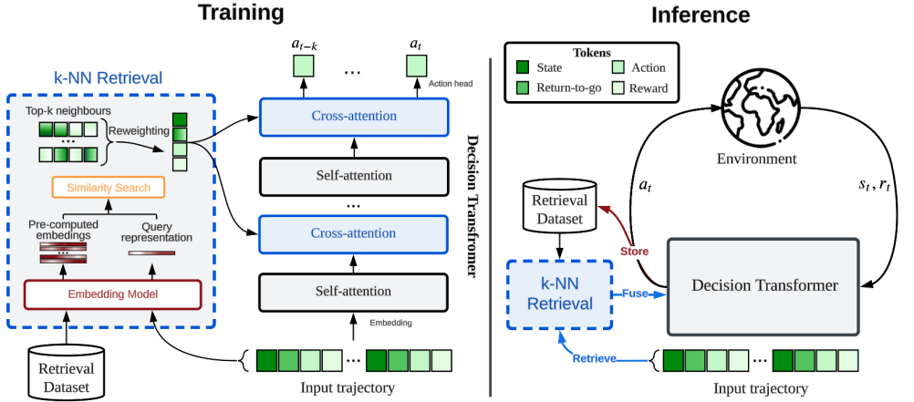

# Retrieval-Augmented Decision Transformer: External Memory for In-context RL
[](https://arxiv.org/abs/2410.07071)
[](https://opensource.org/licenses/MIT)

Thomas Schmied<sup>**1**</sup>, Fabian Paischer<sup>**1**</sup>, Vihang Patil<sup>**1**</sup>, Markus Hofmarcher<sup>**2**</sup>, Razvan Pascanu<sup>**3,4**</sup>, Sepp Hochreiter<sup>**1,5**</sup> 

<sup>**1**</sup>ELLIS Unit Linz and LIT AI Lab, Institute for Machine Learning, JKU Linz, Austria\
<sup>**2**</sup>Extensity AI, <sup>**3**</sup>Google DeepMind\, <sup>**4**</sup>UCL\, <sup>**5**</sup>NXAI

This repository contains the source code for **"Retrieval-Augmented Decision Transformer: External Memory for In-context RL"**.
The paper is available on [ArXiv](https://arxiv.org/abs/2410.07071). 

 

## Overview
This code-based is built on [L2M](https://github.com/ml-jku/L2M) and relies on open-source frameworks, including: 
- [PyTorch](https://github.com/pytorch/pytorch)
- [Huggingface transformers](https://github.com/huggingface/transformers)
- [stable-baselines3](https://github.com/DLR-RM/stable-baselines3)
- [wandb](https://github.com/wandb/wandb)
- [Hydra](https://github.com/facebookresearch/hydra)


What is in this repository?
```
.
├── configs                    # Contains all .yaml config files for Hydra to configure agents, envs, etc.
│   ├── agent_params            
│   ├── wandb_callback_params
│   ├── env_params
│   ├── eval_params
│   ├── run_params
│   └── config.yaml            # Main config file for Hydra - specifies log/data/model directories.
├── continual_world            # Submodule for Continual-World.
├── dmc2gym_custom             # Custom wrapper for DMControl.
├── figures             
├── src                        # Main source directory.
│   ├── algos                  # Contains agent/model/prompt classes.
│   ├── augmentations          # Image augmentations.
│   ├── buffers                # Contains replay trajectory buffers.
│   ├── callbacks              # Contains callbacks for training (e.g., WandB, evaluation, etc.).
│   ├── data                   # Contains data utilities.
│   ├── envs                   # Contains functionality for creating environments.
│   ├── exploration            # Contains exploration strategies.
│   ├── optimizers             # Contains optimizers.
│   ├── schedulers             # Contains learning rate schedulers.
│   ├── tokenizers_custom      # Contains custom tokenizers for discretizing states/actions.
│   ├── utils                  
│   └── __init__.py
├── LICENSE
├── README.md
├── environment.yaml
├── requirements.txt
├── precompute_img_embeds.py   # Script for pre-computing image embeddings.
├── evaluate.py                # Entry point for evaluating agents.
└── main.py                    # Entry point for training agents.
```
## Installation
Environment configuration and dependencies are available in `environment.yaml` and `requirements.txt`.

First, create the conda environment.
```
conda env create -f environment.yaml
conda activate radt
```

Then install the remaining requirements (with MuJoCo already downloaded, if not see [here](#MuJoCo-installation)): 
```
pip install -r requirements.txt
```

Init the `continualworld` submodule and install: 
```
git submodule init
git submodule update
cd continual_world
pip install .
```
Install `meta-world`:
```
pip install git+https://github.com/rlworkgroup/metaworld.git@18118a28c06893da0f363786696cc792457b062b
```

Install custom version of [dmc2gym](https://github.com/denisyarats/dmc2gym). Our version makes `flatten_obs` optional, 
and, thus, allows us to construct the full observation space of all DMControl envs. 
```
cd dmc2gym_custom
pip install -e .
```

Installing `minihack` without sudo rights. In this case, follow instructions provided [here](https://github.com/facebookresearch/nle/issues/246).

To install the GPU version of `faiss` (which we used in our experiments), use: 
```
pip uninstall faiss-cpu
conda install -c conda-forge faiss-gpu=1.7.4
```
In case this installation causes issues, we recommend installing via `mamba`. 

### MuJoCo installation
For the installation of MuJoCo and potential tips on troubleshooting, we refer to the L2M repository: https://github.com/ml-jku/L2M

## Setup

### Experiment configuration
This codebase relies on [Hydra](https://github.com/facebookresearch/hydra), which configures experiments via `.yaml` files. 
Hydra automatically creates the log folder structure for a given run, as specified in the respective `config.yaml` file.

The `config.yaml` is the main configuration entry point and contains the default parameters. The file references the respective default parameter files under the block
`defaults`. In addition, `config.yaml` contains 4 important constants that configure the directory paths: 
```
LOG_DIR: ../logs
DATA_DIR: ../data
SSD_DATA_DIR: ../data
MODELS_DIR: ../models
```

### Datasets
The datasets we generated for grid-worlds are available on the Huggingface Hub 🤗, and can be downloaded using the `huggingface-cli`: 
```
# Dark-Room
huggingface-cli download ml-jku/dark_room --local-dir=./dark_room --repo-type dataset
# Dark Key-Door
huggingface-cli download ml-jku/dark_keydoor --local-dir=./dark_keydoor --repo-type dataset
# MazeRunner
huggingface-cli download ml-jku/mazerunner --local-dir=./mazerunner --repo-type dataset
```

In addition, the datasets for grid-worlds and our Procgen datasets are available on our webserver. 
Download using:  
```
# Dark-Room + Dark KeyDoor
wget --recursive --no-parent --no-host-directories --cut-dirs=2 -R "index.html*" https://ml.jku.at/research/RA-DT/downloads/minihack/dark_room
# MazeRunner
wget --recursive --no-parent --no-host-directories --cut-dirs=3 -R "index.html*" https://ml.jku.at/research/RA-DT/downloads/mazerunner/
# Procgen 2M
wget --recursive --no-parent --no-host-directories --cut-dirs=3 -R "index.html*" https://ml.jku.at/research/RA-DT/downloads/procgen_2M/
# Procgen 20M
wget --recursive --no-parent --no-host-directories --cut-dirs=3 -R "index.html*" https://ml.jku.at/research/RA-DT/downloads/procgen_20M/
```

## Running experiments
In the following, we provide illustrative examples of how to run the experiments in the paper. 

### Dark-Room
To train RA-DT (domain-specific), RA-DT (domain-agnosstic), and AD on Dark-Room 10x10 for 3 seeds each, run: 
```
# RA-DT
python main.py -m seed=42,43,44 experiment_name=darkroom_10x10_radt_v1 env_params=dark_room agent_params=radt_disc_icl run_params=finetune eval_params=pretrain_icl agent_params.load_path.file_name=dt_medium_64_new +agent_params.reinit_policy=True

# RA-DT - domain-agnostic
python main.py -m seed=42,43,44 experiment_name=darkroom_10x10_radt_lm_v1 env_params=dark_room agent_params=radt_disc_icl run_params=finetune eval_params=pretrain_icl agent_params.load_path=null +agent_params/retriever_kwargs=discrete_s_r_rtg +agent_params.retriever_kwargs.beta=10

# AD
python main.py -m seed=42,43,44 experiment_name=darkroom_10x10_ad_v1 env_params=dark_room agent_params=ad_gridworlds run_params=finetune eval_params=pretrain_icl +agent_params.replay_buffer_kwargs.n_ep_later=100
```

Note that domain-specific RA-DT requires to load a pre-trained checkpoint. Pre-train a DT using: 
```
python main.py -m seed=42 experiment_name=darkroom_10x10_dt_pretrain_v1 env_params=dark_room agent_params=dt_gridworlds run_params=finetune eval_params=pretrain_icl_grids agent_params.huggingface.use_fast_attn=False +wandb_callback_params=pretrain
```
Afterwards, the model path can be passed to RA-DT via `agent_params.load_path`.

### Dark Key-Door
For the same methods on Dark Key-Door 10x10, run:
```
# RADT + deduplication
python main.py -m seed=42,43,44 experiment_name=dark_keydoor_10x10_radt_v1 env_params=dark_keydoor agent_params=radt_disc_icl agent_params/data_paths=dark_keydoor_10x10_train run_params=finetune eval_params=pretrain_icl agent_params.load_path='${MODELS_DIR}/minihack/dark_keydoor_10x10/dt_medium_64.zip' +agent_params.reinit_policy=True

# RADT + domain-agnostic
python main.py -m seed=42,43,44 experiment_name=dark_keydoor_10x10_radt_lm_v1 env_params=dark_keydoor agent_params=radt_disc_icl agent_params/data_paths=dark_keydoor_10x10_train run_params=finetune eval_params=pretrain_icl agent_params.load_path=null +agent_params/retriever_kwargs=discrete_s_r_rtg +agent_params.retriever_kwargs.beta=10

# AD
python main.py -m seed=42,43,44 experiment_name=dark_keydoor_10x10_ad_v1 env_params=dark_keydoor agent_params=ad_gridworlds agent_params/data_paths=dark_keydoor_10x10_train run_params=finetune eval_params=pretrain_icl +agent_params.replay_buffer_kwargs.n_ep_later=100
```

### MazeRunner
For the same methods on MazeRunner 15x15, run:

```
# RA-DT
python main.py -m seed=42,43,44 experiment_name=mazerunner_radt_v1 env_params=mazerunner agent_params=radt_mazerunner run_params=finetune eval_params=pretrain_icl +agent_params.reinit_policy=True eval_params.eval_freq=100000 +eval_params.first_step=False eval_params.n_eval_episodes=30

# RA-DT domain-agnostic
python main.py -m seed=42,43,44 experiment_name=mazerunner_radt_lm_v1 env_params=mazerunner agent_params=radt_mazerunner run_params=finetune eval_params=pretrain_icl agent_params.load_path=null +agent_params/retriever_kwargs=discrete_r_rtg_mazerunner +agent_params.retriever_kwargs.beta=10 eval_params.eval_freq=100000 +eval_params.first_step=False eval_params.n_eval_episodes=30

# AD
python main.py -m seed=42,43,44 experiment_name=mazerunner_radt_ad_v1 env_params=mazerunner agent_params=ad_gridworlds agent_params/data_paths=mazerunner15x15 run_params=finetune eval_params=pretrain_icl agent_params.eval_context_len=800 agent_params.huggingface.max_length=400 agent_params.huggingface.n_positions=2400 +agent_params.replay_buffer_kwargs.n_ep_later=1000 eval_params.eval_freq=100000 +eval_params.first_step=False eval_params.n_eval_episodes=30
```

## Citation
If you find this useful, please consider citing our work: 
```
@article{schmied2024retrieval,
  title={Retrieval-Augmented Decision Transformer: External Memory for In-context RL},
  author={Schmied, Thomas and Paischer, Fabian and Patil, Vihang and Hofmarcher, Markus and Pascanu, Razvan and Hochreiter, Sepp},
  journal={ArXiv},
  year={2024},
  url={https://arxiv.org/abs/2410.07071}
}
```
